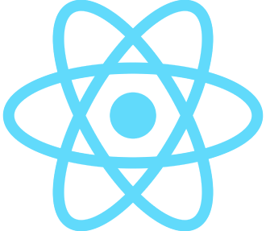

 

  

  <h3 align="center">ReactJS Lab</h3>

  <ul>
    <li>🇧🇷 Laboratório pessoal para experimentações e provas de conceito.</li>
    <li>🇺🇸 Personal laboratory for experiments and proofs of concept.</li>
  </ul>

   

  

## About

This repository stores small projects used to test features or prove a concept for larger projects.

## Table Of Contents

- [About](#about)
- [Content](#content)
  - [Testing the shadcn/ui + TailwindCSS](./shadcn)
